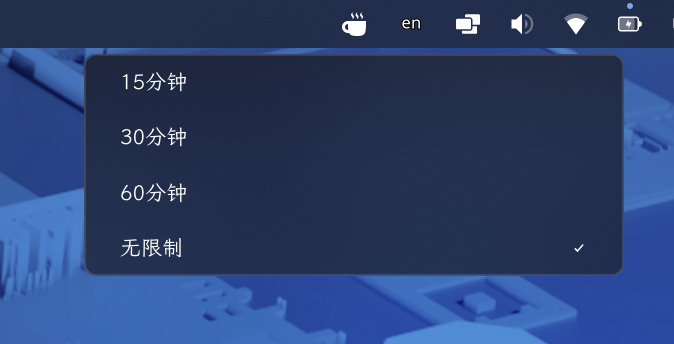

# cosmic-applet-caffeine

[English](README.md) | [简体中文](README.zh-CN.md)

一个用于 [COSMIC](https://system76.com/cosmic) 桌面的极简「咖啡因」小程序（applet）。
它通过 freedesktop 的 `org.freedesktop.ScreenSaver` D-Bus 接口持有一个空闲抑制
（idle inhibitor），让屏幕保持唤醒。



## 功能

- **点击切换** —— 左键点击面板图标，开/关咖啡因。
- **定时激活** —— 右键打开弹出菜单，可选择 15 分钟、30 分钟、60 分钟或无限制。
- **自动释放** —— 选择定时后，计时结束会自动释放抑制。
- **状态图标** —— 通过图标显示当前状态：满杯表示已生效，空杯表示未生效。
- **错误提示** —— D-Bus 操作失败时弹出桌面通知并写入 stderr。
- **多语言** —— 内置英文与简体中文。
- **原生外观** —— 与 COSMIC 官方 applet 使用相同的主题自适应外观，保证与面板外观的一致性。

## 工作原理

连接会话总线，调用 `org.freedesktop.ScreenSaver` 的 `Inhibit` / `UnInhibit`，
请求屏保 / 空闲管理器不要熄屏或锁屏。

## 环境要求

- Rust **1.85+**（工程使用 2024 edition）与 Cargo。
- COSMIC 会话 —— 小程序基于 [libcosmic](https://github.com/pop-os/libcosmic)
  的 `applet` 特性构建。
- 提供 `org.freedesktop.ScreenSaver` 的会话 D-Bus。

> `libcosmic` 依赖来自 git，首次构建需要联网。

## 构建与运行

```sh
cargo run              # 开发模式运行
cargo build --release  # 优化构建
```

## 安装

[`Justfile`](Justfile) 封装了常用操作：

```sh
just build            # 等价于 cargo build --release
just install          # 安装到 /usr（需要 sudo）
just install-local    # 安装到 ~/.local（无需 sudo；图标仍需装到 /usr）
just uninstall
just uninstall-local
```

## 打包为 RPM

```sh
cargo install cargo-generate-rpm
just package          # 等价于 cargo build --release && cargo generate-rpm
```

生成的 `.rpm` 位于 `target/generate-rpm/`。打包配置见 [`Cargo.toml`](Cargo.toml)
中的 `[package.metadata.generate-rpm]`。


## 本地化

字符串通过 `i18n-embed` + [Fluent](https://projectfluent.org/) 管理：

```
i18n/
├── en/cosmic_applet_caffeine.ftl
└── zh-CN/cosmic_applet_caffeine.ftl
```

新增语言：创建 `i18n/<lang>/cosmic_applet_caffeine.ftl` 即可，启动时会根据桌面
环境的语言自动选择。

## 项目结构

```
src/
├── main.rs      # 入口
├── lib.rs       # 小程序 UI 与状态机
├── dbus.rs      # org.freedesktop.ScreenSaver 代理
└── localize.rs  # Fluent 加载器
assets/          # 桌面项与图标
i18n/            # 翻译
Justfile         # 构建 / 安装 / 打包
```

## 许可证

MIT，详见 [LICENSE](LICENSE)。
